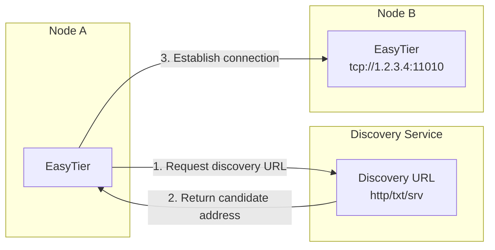

# Discovery URL

EasyTier supports using a Discovery URL to automatically resolve the actual connection address of a peer node. When a node's IP changes frequently, or when you want to distribute node addresses dynamically through a domain name, using a discovery URL eliminates the need to manually maintain the address list.

Users only need to provide a discovery URL at startup, and EasyTier will automatically resolve the peer node's **connector URL** (the address actually used to establish a connection, in the format `scheme://host:port`, such as `tcp://1.2.3.4:11010` or `quic://host:port`) and establish a connection accordingly.



## Supported Discovery URL Types

| Prefix | Description | Example |
| --- | --- | --- |
| `http://` / `https://` | Sends an HTTP request to the URL and extracts the candidate address from the response | `https://discovery.example.com/peer` |
| `txt://` | Queries DNS TXT records and extracts the candidate address from them | `txt://my-network.example.com` |
| `srv://` | Queries DNS SRV records and selects the host and port by priority | `srv://my-network.example.com` |

Simply specify the discovery URL with the `-p` option.

## HTTP / HTTPS

**3xx Redirect**

When the server returns a 302 redirect response, it carries the candidate address information in the `Location` response header. EasyTier first attempts to parse the connector URL from the query parameters of the Location header; if no valid address is found in the query parameters, it then tries to parse the raw value of the `Location` header directly as a connector URL.

```http
HTTP/1.1 302 Found
Location: https://example.com/redirect?target=tcp://1.2.3.4:11010
```

```http
HTTP/1.1 302 Found
Location: tcp://1.2.3.4:11010
```

**2xx Response Body**

The server returns a 200 status code, with each line of the response body providing one candidate address. EasyTier shuffles these addresses randomly and tries to parse them line by line, taking the first valid result.

```http
HTTP/1.1 200 OK
Content-Type: text/plain

tcp://1.2.3.4:11010
quic://5.6.7.8:11010
ws://9.10.11.12:11011/
```

::: warning Note
When multiple candidate addresses exist, EasyTier randomly selects one of them to avoid a single address becoming a hotspot and to distribute load across multiple backends.
:::

## TXT

EasyTier queries the DNS TXT record for `my-network.example.com`, splits the record content into lines, and tries to parse each line as a connector URL, taking the first valid result. An empty record or unparseable content is treated as a discovery failure.

Example DNS TXT records:

```
my-network.example.com.  IN  TXT  "tcp://1.2.3.4:11010"
my-network.example.com.  IN  TXT  "quic://5.6.7.8:11010"
```

## SRV

After querying the SRV records, EasyTier sorts them by priority and weight and selects an appropriate host and port. It then maps them to a connector URL of the corresponding protocol (such as `quic://host:port`) based on the configured `srv_protocols` (for example, `["tcp","udp","quic"]`), and takes the first valid result.

Example DNS SRV records:

```
_my-network._tcp.example.com.  IN  SRV  10 60 11010 node1.example.com.
_my-network._tcp.example.com.  IN  SRV  20 40 11010 node2.example.com.
```
