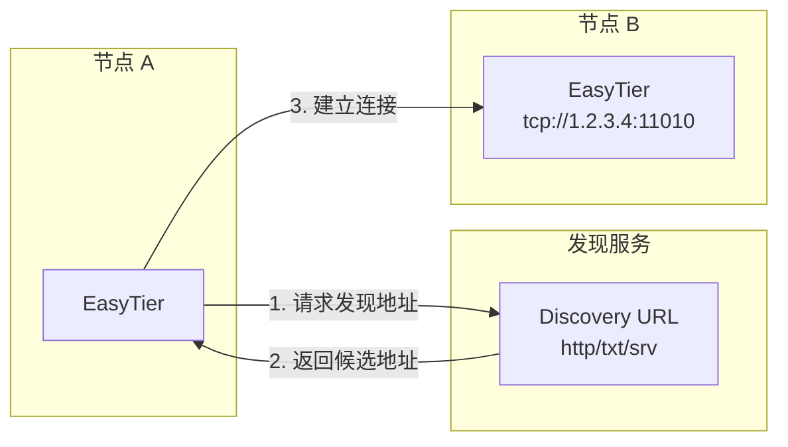

# 发现地址

EasyTier 支持通过发现地址（Discovery URL）来自动解析对端节点的真实连接地址。当节点 IP 经常变动、或希望通过域名动态下发节点地址时，使用发现地址可以免去手动维护地址列表的麻烦。

用户只需在启动时提供一个发现地址，EasyTier 会自动解析出对端节点的**连接地址**（connector URL，即真正用于建立连接的地址，格式为 `协议://主机:端口`，如 `tcp://1.2.3.4:11010`、`quic://host:port`）并据此建立连接。



## 支持的发现地址类型

| 前缀 | 说明 | 示例 |
| --- | --- | --- |
| `http://` / `https://` | 向该 URL 发起 HTTP 请求，从响应中提取候选地址 | `https://discovery.example.com/peer` |
| `txt://` | 查询 DNS TXT 记录，从中提取候选地址 | `txt://my-network.example.com` |
| `srv://` | 查询 DNS SRV 记录，按优先级选择主机与端口 | `srv://my-network.example.com` |

使用 `-p` 参数指定发现地址即可

## HTTP / HTTPS

**3xx 重定向**

当服务端返回 302 重定向响应时，会在 `Location` 响应头中携带候选地址信息。EasyTier 会优先尝试从 Location 头的查询参数中解析连接地址；若未在查询参数中找到有效地址，则会尝试将 `Location` 头的原始值直接解析为连接地址。

```http
HTTP/1.1 302 Found
Location: https://example.com/redirect?target=tcp://1.2.3.4:11010
```

```http
HTTP/1.1 302 Found
Location: tcp://1.2.3.4:11010
```

**2xx 响应体**

服务端返回 200 状态码，响应体每行提供一个候选地址。EasyTier 会将这些地址随机打乱后逐行尝试解析，取第一个成功解析的有效结果。

```http
HTTP/1.1 200 OK
Content-Type: text/plain

tcp://1.2.3.4:11010
quic://5.6.7.8:11010
ws://9.10.11.12:11011/
```

::: warning 提示
当存在多个候选地址时，EasyTier 会随机选取其中一个，避免单一地址成为热点，同时在多个后端之间分散负载。
:::

## TXT

EasyTier 会查询 `my-network.example.com` 的 DNS TXT 记录，将记录内容按行拆分，逐行尝试解析为连接地址，取第一个有效结果。空记录或无可解析内容时视为发现失败。

DNS TXT 记录示例：

```
my-network.example.com.  IN  TXT  "tcp://1.2.3.4:11010"
my-network.example.com.  IN  TXT  "quic://5.6.7.8:11010"
```

## SRV

EasyTier 查询 SRV 记录后，会按照优先级和权重排序，从中选取合适的主机与端口；随后结合配置的 `srv_protocols`（例如 `["tcp","udp","quic"]`），将其映射为对应协议的连接地址（如 `quic://host:port`），最终取第一个有效的结果。

DNS SRV 记录示例：

```
_my-network._tcp.example.com.  IN  SRV  10 60 11010 node1.example.com.
_my-network._tcp.example.com.  IN  SRV  20 40 11010 node2.example.com.
```